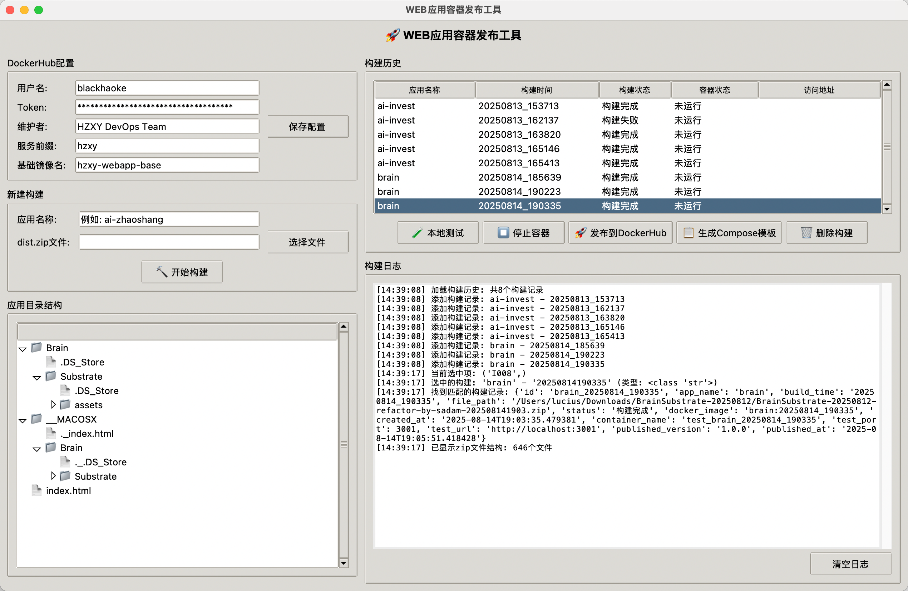

# WEB应用容器发布Agent

开发环境专用工具，用于构建前端应用容器镜像并发布到DockerHub。支持GUI界面和命令行两种使用方式。



## 功能特性

- 🖥️ **跨平台支持**: Windows、macOS、Linux
- 🎨 **GUI界面**: 基于tkinter的友好图形界面
- 💻 **命令行工具**: 支持脚本自动化
- 🐳 **Docker集成**: 自动构建和推送镜像到DockerHub
- 📋 **模板生成**: 自动生成docker-compose部署模板
- ⚙️ **配置管理**: 支持配置文件和环境变量
- 🔧 **可配置化**: 支持自定义服务前缀和基础镜像名称

## 安装要求

### 系统要求
- Python 3.7+
- Docker Desktop (已安装并运行)
- DockerHub账号和访问令牌

### Python依赖
```bash
pip install -r requirements.txt
```

## 快速开始

### 1. 环境配置

设置DockerHub凭据（二选一）：

**方法一：环境变量**
```bash
export DOCKERHUB_USERNAME=your_username
export DOCKERHUB_TOKEN=your_token
```

**方法二：GUI界面配置**
```bash
python app.py start --gui
```

### 2. 启动方式

**GUI模式（推荐）**
```bash
# 直接运行（默认启动GUI）
python app.py

# 或明确指定GUI模式
python app.py start --gui

# 使用便捷脚本
./start.sh
```

**命令行模式**
```bash
# 发布应用
python app.py publish ai-zhaoshang 1.0.0 /path/to/dist.zip

# 查看配置
python app.py config

# 生成docker-compose模板
python app.py template ai-zhaoshang --port 3000

# 查看帮助
python app.py --help
```

## 使用流程

### GUI模式使用流程

1. **配置参数**
   - 填写DockerHub用户名和访问令牌
   - 设置维护者信息
   - 配置服务前缀（默认：hzxy）
   - 配置基础镜像名称（默认：hzxy-webapp-base）
   - 点击"保存配置"

2. **填写应用信息**
   - 应用名称：如 `ai-zhaoshang`
   - 版本号：如 `1.0.0`

3. **选择文件**
   - 点击"选择文件"按钮
   - 选择前端团队提供的 `dist.zip` 文件

4. **构建发布**
   - 点击"🚀 构建并发布"按钮
   - 查看实时构建日志
   - 等待发布完成

5. **生成部署模板**
   - 点击"📋 生成docker-compose模板"
   - 保存模板文件用于AI盒子部署

### 命令行模式使用流程

```bash
# 1. 检查配置
python app.py config

# 2. 发布应用
python app.py publish ai-zhaoshang 1.0.0 ./ai-zhaoshang-dist.zip

# 3. 生成部署模板
python app.py template ai-zhaoshang --port 3000
```

## 镜像命名规范

生成的Docker镜像遵循以下命名规范：
- 格式：`{DOCKERHUB_USERNAME}/{BASE_IMAGE_NAME}-{应用名称}:{版本号}`
- 示例：`myuser/hzxy-webapp-base-ai-zhaoshang:1.0.0`
- 同时会创建 `latest` 标签
- BASE_IMAGE_NAME 可在GUI界面配置，默认为 `hzxy-webapp-base`

## 部署模板

工具会自动生成适用于AI盒子的docker-compose模板：

```yaml
services:
  hzxy-ai-zhaoshang:
    image: myuser/hzxy-webapp-base-ai-zhaoshang:latest
    container_name: hzxy-ai-zhaoshang
    ports:
      - "3000:80"
    restart: unless-stopped
    networks:
      - hzxy-network

networks:
  hzxy-network:
    driver: bridge
```

**注意**: 服务名称和网络名称中的前缀（如 `hzxy-`）可在GUI界面配置，默认为 `hzxy`

## 文件结构

```
agent/
├── app.py              # 主程序文件
├── requirements.txt    # Python依赖
├── start.sh           # 启动脚本
├── README.md          # 说明文档
├── builds/            # 构建临时目录
└── ~/.hzxy-agent-config.json  # 配置文件
```

## 配置文件

配置文件位置：`~/.hzxy-agent-config.json`

```json
{
  "DOCKERHUB_USERNAME": "your_username",
  "DOCKERHUB_TOKEN": "your_token",
  "MAINTAINER": "HZXY DevOps Team",
  "SERVICE_PREFIX": "hzxy",
  "BASE_IMAGE_NAME": "hzxy-webapp-base"
}
```

## 故障排除

### 常见问题

**1. GUI模式无法启动**
```
警告: 无法导入tkinter，GUI模式不可用
```
解决方案：
- macOS: `brew install python-tk`
- Ubuntu: `sudo apt-get install python3-tk`
- Windows: 重新安装Python并勾选tkinter组件

**2. Docker构建失败**
```
Cannot connect to the Docker daemon
```
解决方案：
- 确保Docker Desktop已启动
- 检查Docker服务状态

**3. DockerHub推送失败**
```
denied: requested access to the resource is denied
```
解决方案：
- 检查DockerHub用户名和Token是否正确
- 确保Token有推送权限

### 日志查看

- GUI模式：查看界面底部的"构建日志"区域
- 命令行模式：直接在终端查看输出
- 构建过程中的临时文件在 `builds/` 目录

## 开发说明

### 项目结构
- `PublisherGUI`: GUI界面类
- `build_and_push_image()`: 核心构建发布函数
- `cli`: Click命令行接口
- 配置管理：支持文件和环境变量

### 扩展功能
- 支持多种基础镜像
- 自定义Dockerfile模板
- 批量发布功能
- 发布历史记录

## 许可证

本项目采用自定义的非商业源码可见许可证（Source-Available License）。

### 版权声明

**版权所有 © 2024 萨达木·沙地克 (Sadam·Sadik)。保留所有权利。**

**联系方式**: 1903249375@qq.com, haoke98@outlook.com

- **软件著作权**: 完全归属于作者
- **作品著作权**: 完全归属于作者  
- **专利所有权**: 完全归属于作者

### 许可条款

✅ **允许的用途：**
- 个人学习和研究
- 教育用途
- 非营利性项目
- 学术研究
- 开源贡献和改进

❌ **禁止的用途：**
- 任何形式的商业用途
- 盈利性项目或服务
- 商业销售、分发或授权
- 未经授权的专利实施

### 使用条件

1. **署名要求**: 使用时必须保留原作者署名和版权声明
2. **非商业限制**: 严禁用于任何商业目的
3. **源码开放**: 基于本项目的衍生作品必须开源
4. **权利保留**: 作者保留软件著作权、作品著作权和专利权
5. **授权撤回**: 作者有权随时撤回对违反许可条款的用户的授权

### 商业授权

如需商业使用，请联系作者获得商业授权许可。

---

**免责声明**: 本软件按"现状"提供，不提供任何明示或暗示的担保。作者不对使用本软件造成的任何损失承担责任。